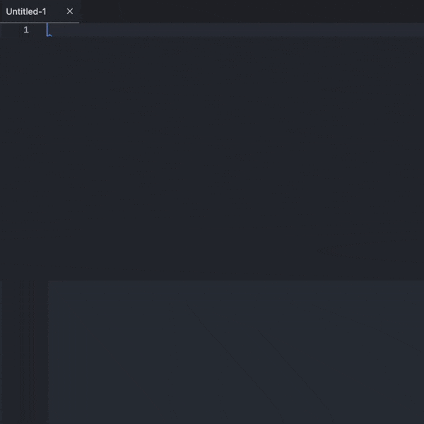
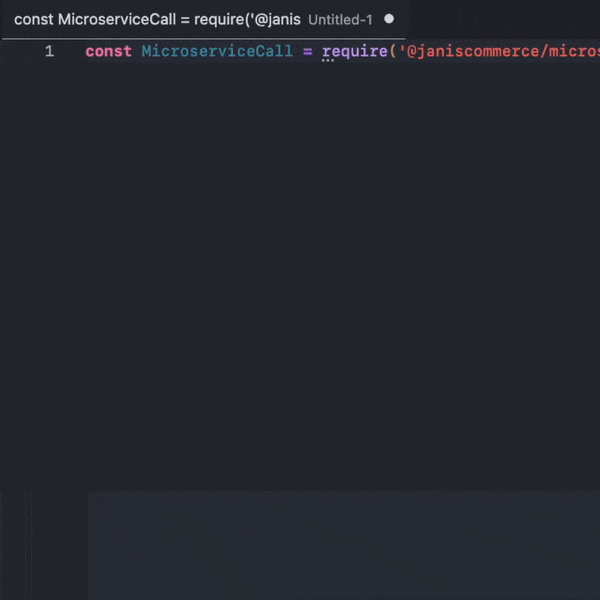
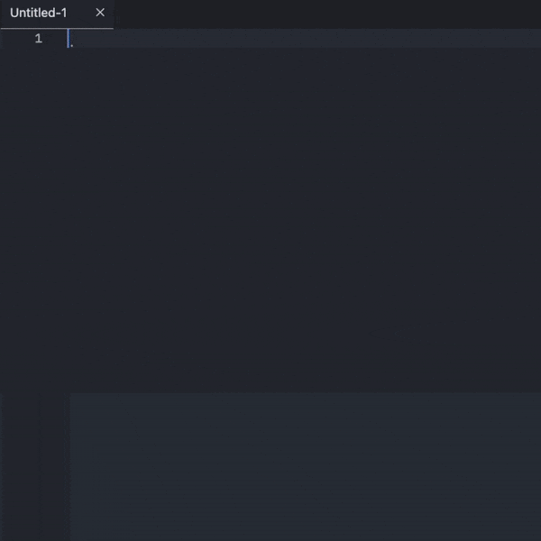
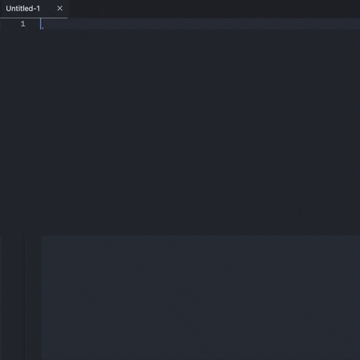
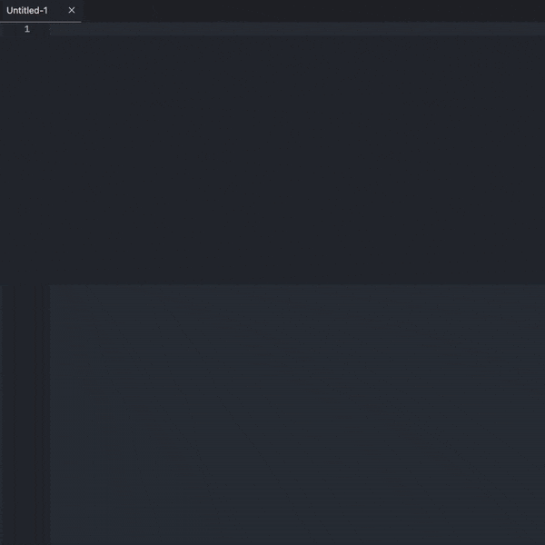
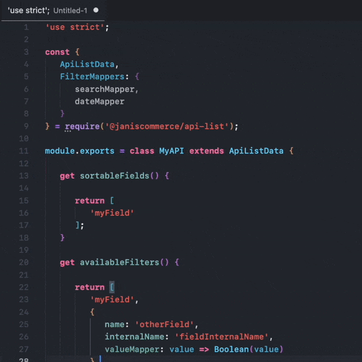
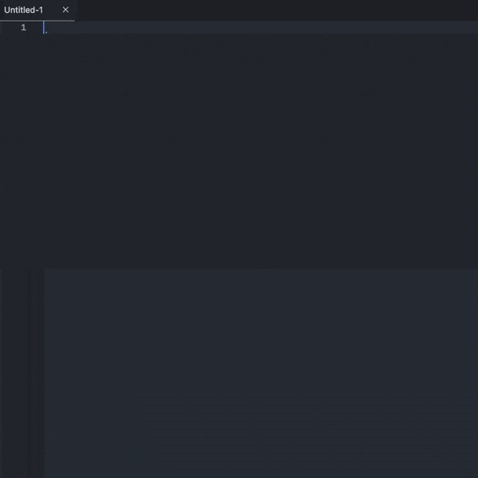
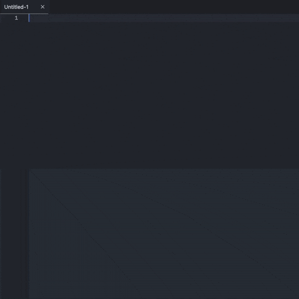

# Janis Commerce VSCode Extension

This is the official VSCode extension for the `@janiscommerce` ecosystem.

## UI Customizations

- Custom file icon for `.janiscommercerc.json` config file ([@janiscommerce/settings](http://npmjs.com/package/@janiscommerce/settings))

## Code Snippets

- Generic Javascript
  - `strict`

- New file boilerplate
  - `newclass`

- [API Session](https://www.npmjs.com/package/@janiscommerce/api-session)
  - `getSessionInstance`

- Require a @janiscommerce package
  - `j-rqr`
  

  
  

- [Model](https://www.npmjs.com/package/@janiscommerce/model)
  - `model`
  

  
  

- [API](https://www.npmjs.com/package/@janiscommerce/api)
  - `api-generic`
  

  
  

- [API Save](https://www.npmjs.com/package/@janiscommerce/api-save)
  - `api-save`
  

  
  

- [API List](https://www.npmjs.com/package/@janiscommerce/api-list)
  - `api-list`
  - `api-list-value-mapper`
  

  
  

- [API Get](https://www.npmjs.com/package/@janiscommerce/api-get)
  - `api-get`
  

  
  

- [API Test](https://www.npmjs.com/package/@janiscommerce/api-test)
  - `api-test`
  - `api-test-item`
  

  
  

- [Lambda](https://www.npmjs.com/package/@janiscommerce/lambda)
  - `lambda`
  

  
  
